# bikesharing
[link to dashboard](https://public.tableau.com/app/profile/xinghui.li/viz/Challenge_16267652183350/Challenge?publish=yes)

## Overview of the statistical analysis:
- The purpose of this project is desgined to analyze the New York Citi Bike Data, through using Tableau to explore data visualization.

## Results:

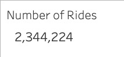
- There was a total of 2,344,224 trips in the month of August.

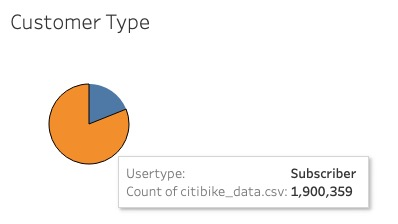
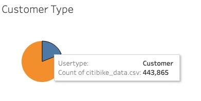
- From the total trips 1,900,359 users subscribe to the company and 443,865 users are customers.

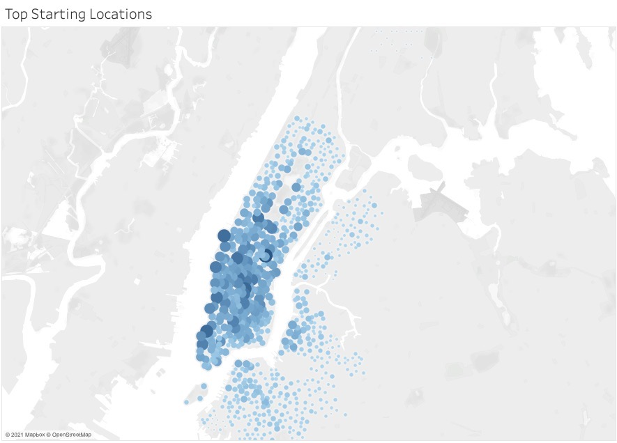
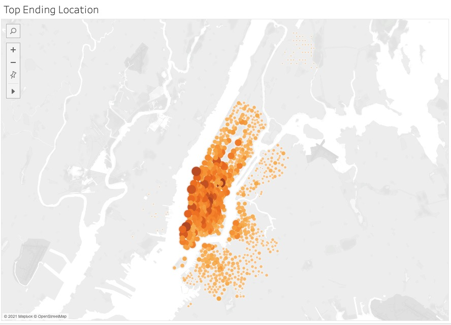
- The main locations are relatively concentrated in the center of New York, Manhattan.

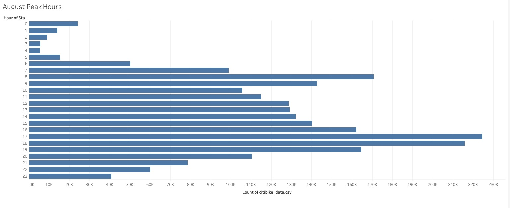
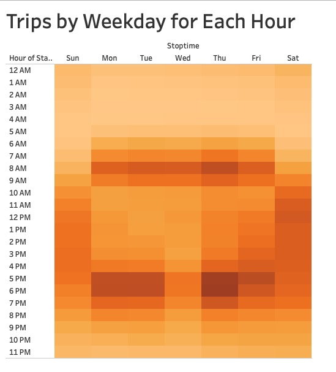
- The peak hours are concentrated on commuting time, between 7 and 0 & between 16 and 19.

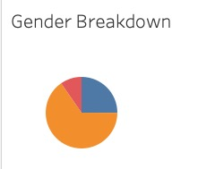
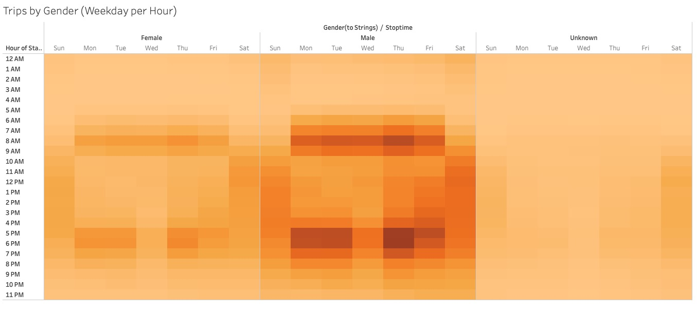
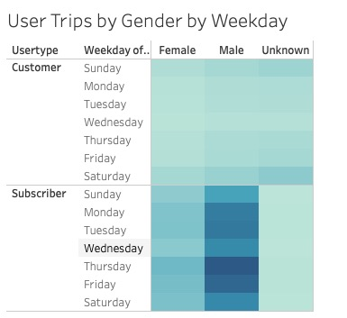
- The largest number of individuals is male, the women users dont have as large of numberand unknown users do not have a lot for trip duration.

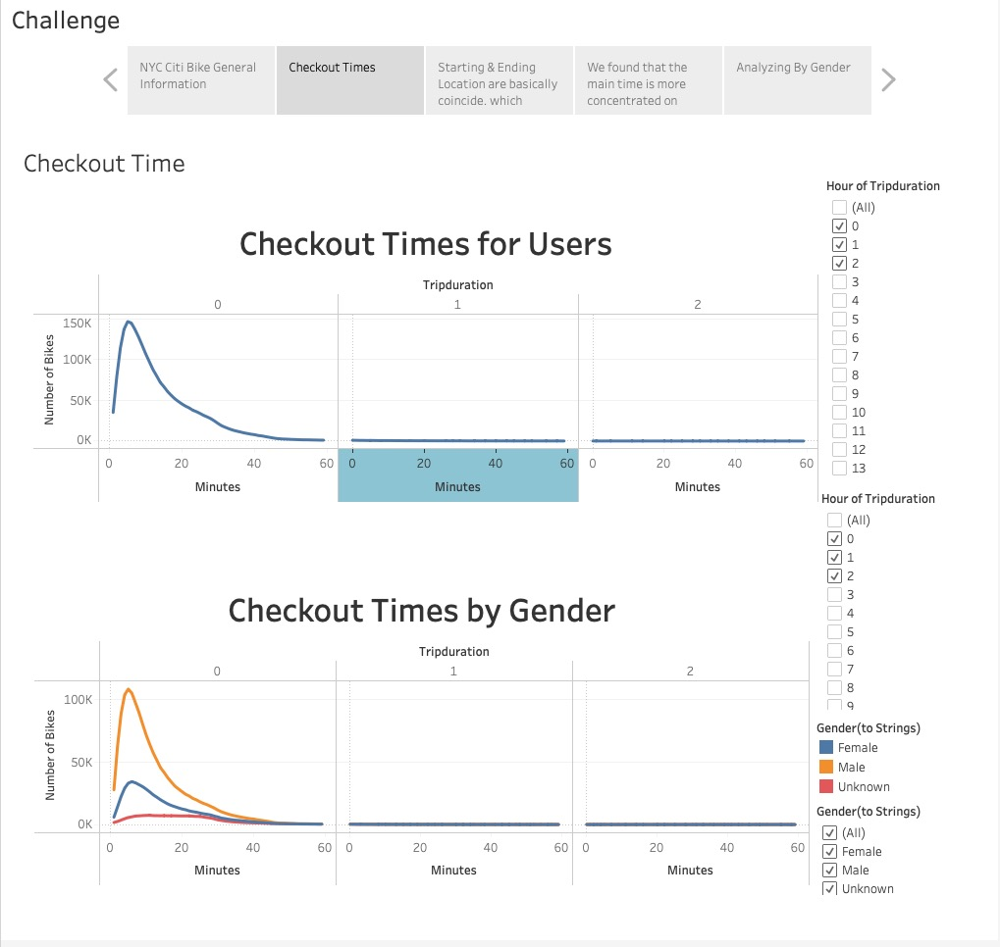
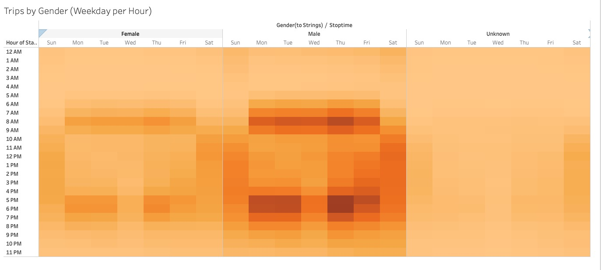
- Male users take approximately 3 times more rides than the female users.

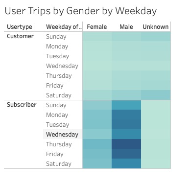
- The majority users are male and subscriber.

## Summary:
- Through the results, we think majority users using this server for commuting, I think the citibike could increase the price during the commuting time to max the profit. In addition, we cannot only analyze the summer data, we also need to analyze the winter data, and comparing them. Moreover, we could do the deeply analysis on the customer's location and bike rental location which would reduce the distance of walking so that we might attract more customers.